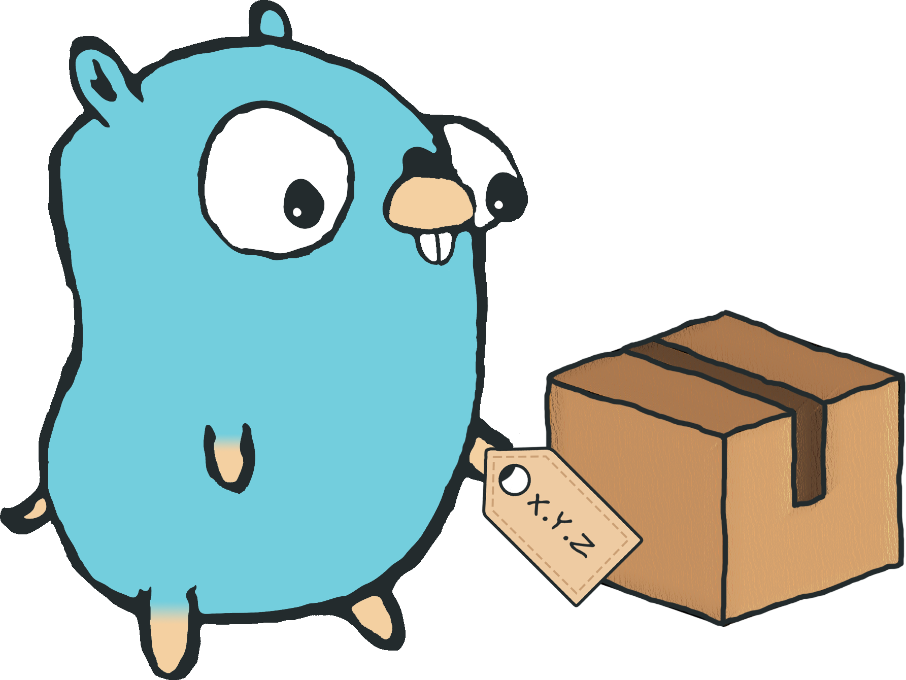

# Go Semver Release

  
    
  
  
  
  
  
  
  
  
  

Go Semver Release is a CLI program designed to automate versioning of Git repository by analyzing their [formatted commit history](https://www.conventionalcommits.org) and tagging them with the right [SemVer](https://semver.org/spec/v2.0.0.html) number.

This documentation is also available at [https://go-semver-release.akira.sh](https://go-semver-release.akira.sh)&#x20;

## Features

* 🏷️ Automatic semantic versioning of your Git repository via annotated Git tags
* 🌐 Local or remote mode of execution (local removes the need for secret token)
* 🌴 Support for multiple release branches, prerelease and build metadata
* 🗂️ Support for monorepo (i.e., multiple projects inside a single repository, all versioned separately)
* ⚙️ Custom tag prefix
* 📝 Tag signature using GPG

## Motivation

This tool automates semantic versioning for Git repositories in a language and CI-agnostic way by following Semantic Versioning and Conventional Commits conventions.

Following the UNIX philosophy of doing one thing well, it only publishes SemVer tags to your Git repository—no package publishing or other features.

Requirements: an initialized Git repository, a release branch (e.g. main), and commit history following the Conventional Commits specification. Many IDEs offer plugins to help format commit messages (e.g., VSCode, IntelliJ).

> [!NOTE]
> This program can only read annotated Git tags. If you need to manually add a SemVer tag to your repository, make sure it is annotated; otherwise the program will not detect it.

## How is this different from \<insert\_another\_tool> ?

Other tools exist to version software using semantic versions such as [semantic-release](https://github.com/semantic-release/semantic-release). Go Semver Release focuses on versioning only, no package publishing, release log generation or other features.

If you want a simple tool that handles the generation of the next semantic version tag for your project, you are in the right place. This allows the program to work faster and with minimal dependencies.

## Documentation

### Usage

* [Install](usage/install.md)
* [Quickstart](usage/quickstart.md)
* [Configuration](usage/configuration.md)
* [Output](usage/output.md)

### Recipes

* [Workflow examples](recipes/workflow-examples.md)

### Miscellaneous

* [Benchmark](miscellaneous/benchmark.md)
* [How it works](miscellaneous/how-it-works.md)

## Support

If you are using this project and find it useful, consider giving it a star.
 

Project's illustration designed by [@TristanDacross](https://github.com/TristanDacross)
