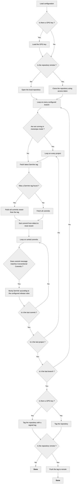

# How it works

## Single Bump Per Release

When computing the next semantic version, Go Semver Release applies **only one bump per release cycle**, using the highest-priority bump type found across all commits since the last tag.

The bump priority order is: `major` > `minor` > `patch`

**Example:**
If commits since the last tag include:
- `fix: bug fix` (patch)
- `feat: new feature` (minor)
- `fix: another bug` (patch)

The result is a **single minor bump**, not `minor + 2 patches`. This follows SemVer best practices where a release represents a cohesive set of changes.

## Prerelease Versioning

Prerelease branches produce versions with numbered suffixes following the SemVer 2.0 standard:

```
<version>-<branch>.<number>
```

**Examples:**
- First prerelease: `1.0.0-rc.1`
- Second prerelease: `1.0.0-rc.2`
- After breaking change: `2.0.0-rc.1`

### Prerelease Promotion

When a prerelease branch is merged into a stable branch, the prerelease is automatically **promoted** to a stable release:

- If `main` branch sees tag `1.0.0-rc.3` as its latest, it produces `1.0.0`
- If there are new commits after the merge, normal bump rules apply (e.g., `1.0.1` for a fix)

This enables a standard release workflow:
1. Develop on `rc` branch → `1.0.0-rc.1`, `1.0.0-rc.2`, ...
2. Merge `rc` into `main` → `1.0.0` (stable release)

## Execution Flow

When executed, the program will go through the following steps:


