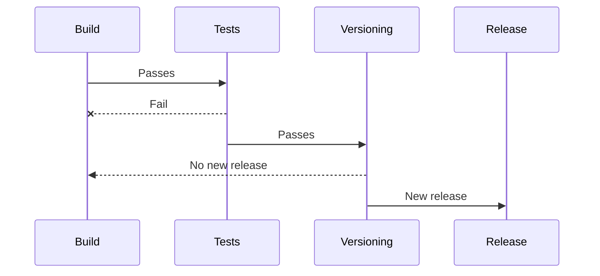

# CI Examples

## Versioning workflow

Since Go Semver Release is CI agnostic, this page aims to give a few examples of CI workflows that you can implement to benefit the most out of this program.

A typical workflow versioning your repository using Go Semver Release would look like this:

### Workflow examples

