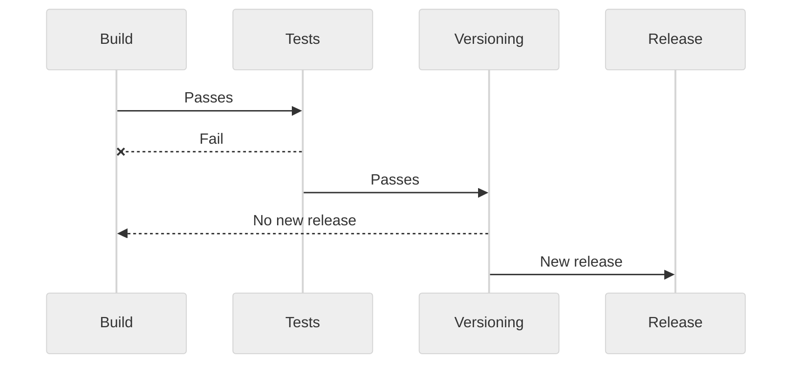

# Workflow examples

## Versioning workflow

Since Go Semver Release is CI agnostic, this page aims to give a few examples of CI workflows that you can implement to benefit the most out of this program.

A typical workflow versioning your repository using Go Semver Release would look like this:

### Workflow example

> [!WARNING]
> Usually, the first step in a CI/CD job is to clone (or "checkout") the repository on which the workflow will operate. When doing so, the checkout step usually has a `depth` property allowing you to fetch tags. Make sure that all annotated tags are fetched otherwise the program will not be able to detect previous semantic version tags.

Below are simple pipeline examples for various CI providers:

* [GitHub Actions](https://github.com/s0ders/go-semver-release/blob/main/docs/examples/github-actions-remote-mode.yml) using remote mode
* [GitHub Actions](https://github.com/s0ders/go-semver-release/blob/main/docs/examples/github-actions-local-mode.yml) using local mode
