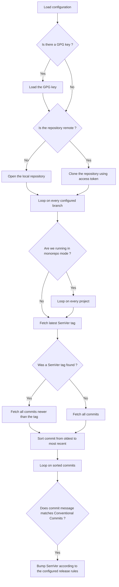

# How it works

When executed, the program will go through the following steps:

```mermaid
flowchart TB
  A["Load configuration"] --> B{"Is there a GPG key ?"}
  B -- Yes --> C["Load the GPG key"]
  C --> D
  B -- No --> D{"Is the repository remote ?"}
  D -- Yes --> E["Clone the repository using access token"]
  D -- No --> F["Open the local repository"]
  F & E --> G["Loop on every configured branch"]
  G --> H{"Are we running in monorepo mode ?"}
  H -- Yes --> I["Loop on every project"]
  H -- No --> J["Fetch latest SemVer tag"]
  I --> J
  J --> K{"Was a SemVer tag found ?"}
  K -- Yes --> L["Fetch all commits newer than the tag"]
  K -- No --> M["Fetch all commits"]
  L & M --> N["Sort commit from oldest to most recent"]
  N --> O["Loop on sorted commits"]
  O --> P{"Does commit message matches Conventional Commits ?"}
  P -- Yes --> Q["Bump SemVer according to the configured release rules"]
```

1. Tag the repository and sign it if a GPG key was passed
2. Push the tag to remote if executed in remote mode
