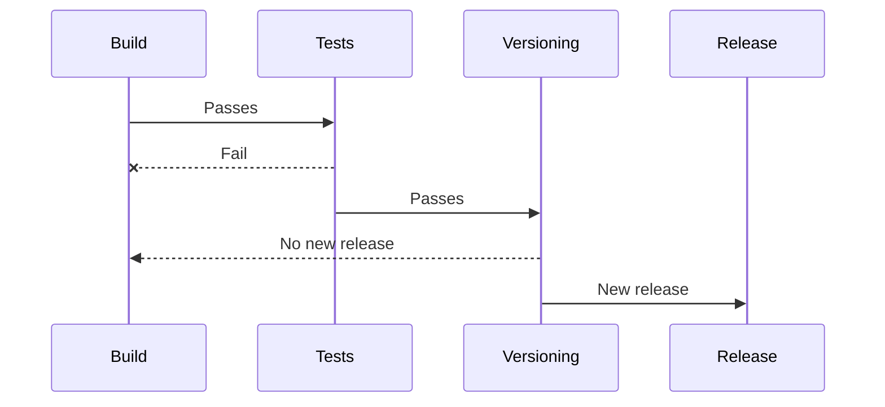

# Usage in CI/CD

## Versioning workflow

Since Go Semver Release is CI agnostic, this page aims to give a few examples of CI workflows that you can implement 
to benefit the most out of this program.

A typical CI workflow using Go Semver Release would look like this:

## Pipeline examples

> [!IMPORTANT]
>
> Usually, the first step in a CI/CD job is to "checkout" or clone the repository being worked on by the CI/CD workflow. Please make sure that in the step or job using Go Semver Release, the repository is cloned along with its annotated tags, otherwise previous SemVer tags will not be detected.

Below are simple pipeline examples for various CI providers:

- [GitHub Actions](examples/github-actions-remote-mode.yml) using remote mode
- [GitHub Actions](examples/github-actions-local-mode.yml) using local mode