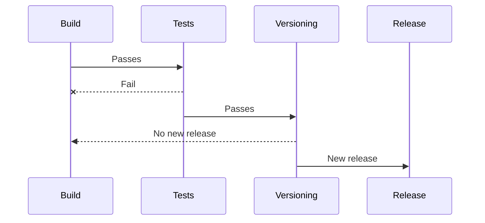

# CI/CD Worflows

## Basics

### Versioning workflow
Since the `go-semver-release` program is CI agnostic and works in local mode only, this page aims to give a few examples
of CI workflow that you can implement to benefit the most out of this program.

A typical CI workflow using semantic versioning would look like this:

Here is the catch: most CI tools offer an isolation level between these steps and `go-semver-release` only tags
the local copy of your repository. This implies that, unless you push back the tag to your remote right after the
versioning step — which is not advised for reasons that will become clear soon —, the tag will not be persisted on your
repository since each step gets a "fresh" copy of the repository at the time the pipeline was triggered.
 
### Pre-release tags

Why not tag your repository right away ? You might need a version number early in your workflow to tag your artifacts but
versioning and pushing a semver tag before validating all checks mean that you may end up with a release tag pointing
to a faulty release. 

A solution is to create a pre-release tag in the following format: `<VERSION>-<TIMESTAMP>-<COMMIT_HASH>` such
as `v1.2.3-20240731-fc497a6`. This pre-release number can then be used to tag your artifacts. Once all checks are green,
you can promote your artifacts to production by tagging them with the actual semver release tag and tag your repository.

To get create the pre-release tag, simply run `go-semver-release` in dry-run mode and get the `next-release` output key
if there is one, or rely on the GitHub output if you are running the CLI as part of a GitHub action workflow. From
there, you can append whatever you feel to the next release number, though it is usually advised to use unique
identifiers such as a timestamp or a commit hash.

## Pipeline examples

Bellow are simple pipeline examples for various CI provides:
- [GitHub Actions](examples/github-actions.yml)
- [GitLab CI](examples/gitlab-ci.yml)